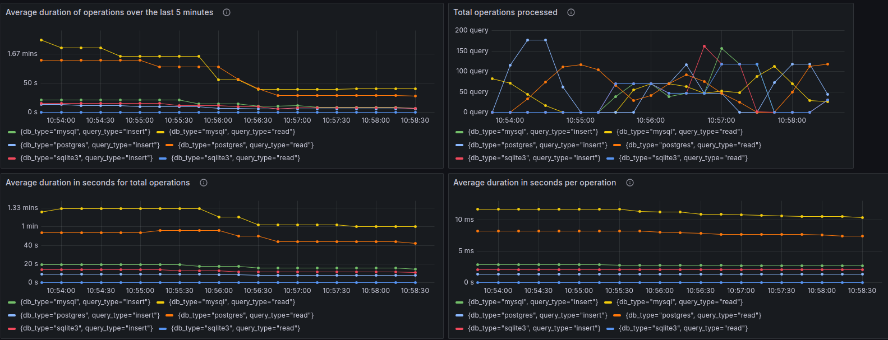

# Go loadtest DBs

Go app that runs an infinite loop loadtest against MySQL, PostgreSQL and Sqlite, one by one.
MySQL and PostgreSQL are each deployed to docker containers. The Sqlite DB (`test.db`) is local.

The LT cycles (inserts, reads, drop DB) are delayed by some random Milliseconds and inserts only (random strings) are also delayed by random Microseconds.



## Project Structure

- [main.go](main.go): The entry point of the application
- [docker-compose.yaml](docker-compose.yaml): Container definitions
- [grafana_dashboard.json](provisioning/dashboards/grafana_dashboard.json): Grafana Dashboard that is automatically imported when grafana container starts
- [dashboard.yml](provisioning/dashboards/dashboard.yml) - YAML for importing Grafana dashboards
- [datasource.yml](provisioning/datasources/datasource.yml) - YAML file for automatically create the `prometheus` datasource in Grafana
- [prometheus.yml](prometheus.yml) - Prometheus YAML config

## Running the Application

### Creating the containers
```shell
COMPOSE_DOCKER_CLI_BUILD=1 DOCKER_BUILDKIT=1 docker-compose build
```

### Starting the containers
```shell
COMPOSE_DOCKER_CLI_BUILD=1 DOCKER_BUILDKIT=1 docker-compose up -d
```

### Run the LT app
```shell
go run main.go
```
## Checking the graphs

- [Grafana](http://localhost:3000/) - default user&pass is `admin`
- [Prometheus Server](http://localhost:9090/)
- [Go app Prometheus metrics](http://localhost:8080/metrics)


## Cleanup

```shell
COMPOSE_DOCKER_CLI_BUILD=1 DOCKER_BUILDKIT=1 docker-compose down
```